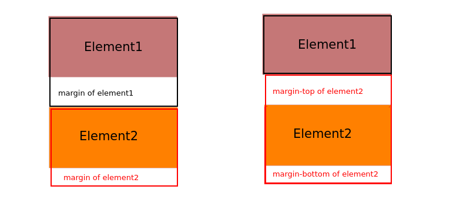

# 1주차 개발 일지
HTML과 CSS는 많은 내용이 코드아카데미에서 배운 내용과 같으므로 특별히 기억할 필요가 있는 정보 중심으로 필기함.

## 1. 웹개발의 기본적 구조
- HTML: 뼈대
- CSS : 장식
- JS: 작동, 기능   
## 2. 부트스트랩 bootstrap

> the most popular CSS Framework for developing responsive and mobile-first websites

- 자주 쓰이는 <b>CSS 형식의 템플릿</b>을 모아두어, 웹개발 시 편리하게 끌어다 쓸 수 있도록 한 일종의 <b>템플릿모음(Framework)</b>  
- 웹개발에서 반복적으로 사용되는 코드들(e.g. 버튼, 로그인 입력 양식)를 템플릿으로 제공
- 템플릿들의 조합으로 간편한 페이지 생성 가능


## 3. HTML/CSS 새로 배운 것들
-  HTML/CSS 요소와 속성에 대한 정보는 [MDN](https://developer.mozilla.org/ko/docs/Web), [W3schools](https://www.w3schools.com/html/)를 참조
   
- 자주 쓰이는 포맷이 분명하며 주로 함께 쓰이는 속성들을 기억해두면 좋다. 
  ```jsx  
  .login {          // e.g.) 컴포넌트에 그림배경을 쓸 때 주로 함께 쓰이는 속성들
      background-image: url("http://...");
      background-size: ...;
      background-position: center;
    }
  ```
  
- 문서 전체 대상 속성은 다음과 같이 표기 (e.g. 기본 폰트)
  ```jsx
  * {
      font-family: 'Stylish', sans-serif;
  }
  ```
- margin

    
## 4. Javascript
- 자바와 자바스크립트의 관계는 코끼리와 바다코끼리의 그것과 같다. 전혀 다른 언어.

### 기초 문법

- 변수 선언
   ```jsx
   let a = 3;
    
   let c = [1,2,3,4];                          //배열, c[0], c[1],....과 같이 접근 가능
    
   let d = {'name' : 'bob', 'age' : 27}        //딕셔너리, d['name']과 같이 접근 가능
   
   d['height'] = 180;                          //딕셔너리의 요소 추가
   ```
- String 관련 메소드
   ```jsx
   let myemail = 'sparta@gmail.com'
   myemail.split('@')
   //-> (2) ['sparta', 'gmail.com'] 과 같이 분리된 스트링을 배열로 반환
   ```
- 함수 선언
   ```jsx
   function myFunction(p1, p2) {
     return p1 * p2;                    // 이 함수의 리턴값
   } 
   
   myFunction = (p1, p2) => {           // Arrow function, 위와 같은 내용
      return p1 * p2;
      }
   
   myFunction = (p1, p2) => p1 * p2;    // 더 짧은 Arrow function, 함수의 내용이 한 줄일 때에 사용가능 
   ```
- 함수의 실행
   ```jsx
   function mysum(num1, num2){
      alert('안녕!')
      return num1+num2
      }
   
   > let num = mysum(1, 2)
   // alert가 실행되고 발생한 팝업 메세지를 확인해야 return 1+2가 실행되면서 num에 값 3이 지정됨
   ```
- 반복문
   - if ... else ..., for 구문은 다른 기본 언어들과 거의 동일

- 주요 함수
   -`console.log('안녕하세요')` : 콘솔 문구 출력  

## 4. 1주차 과제


### 새로 배운 점
- img는 인라인 요소. display:block;으로 css 디스플레이 양식을 인라인에서 블록으로 바꿔주어야 margin과 같은 블록 전용 속성을 사용할 수 있다.  
-부트스트랩 form은 number type input을 지원한다. 그리고 도큐먼테이션에는 나와있지 않지만 다른 타입의 인풋들도 모두 지원될 것 같다. 
-HTML/CSS와 달리 JS내에서 변수와 함수 이름에 -가 들어갈 수 없는 점을 주의. 
-클래스 이름 지정 시 item-img, item-desc, btn-order와 같은 축약형 이름을 사용, 주로 통용되는 키워드가 있을 것으로 보임.


### 궁금한 점
- 부트스트랩 상에 지정된 클래스 이름을 사용하여 CSS 설정 오버라이딩이 가능한가? 가능하다고 해도 권장되는 방법인가?
- 다음 두가지 경우 중 어느쪽이 더 바람직한가? 우측이 더 짧은 css 코드를 가짐 (나열된 div 간의 margin을 조절 시 기준?)

